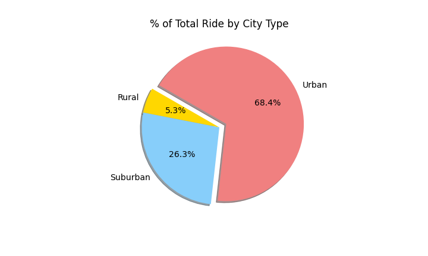
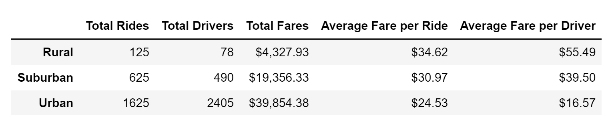
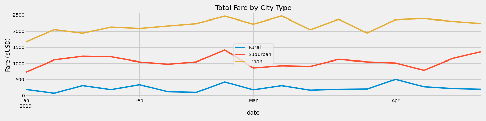

# PyBer Analysis

## Overview of the Analysis
PyBer Analysis project uses January to early May of 2019 ride-share data to perform exploratory analysis. We use Panda's libraries, the jupyter Notebook, and Matplotlib to create a variety of visualization to explore the relationship of different city types, drivers and riders as well as the fares. By analyzing these data, we provide recommandations to decision-maker and help Pyber improve access to ride-sharing services.
## Analysis Results
We use city and ride dataset to create piecharts to present the realtionship between different city types and other 3factors: fares, rides and drivers. Based on the city types, we can see that Urban has the most majority of the total fares,total rides and drivers.Comparing to Urban cities, Rural cities has infinitesimal proportion. Suburban cities has roughly half of Urban on the percentage of total fares and rides. However, the % of drivers on Urban is almost 4times greater than Suburban cities.
  - Percentage of Total Fares by City Type    
      
  - Percentage of Total Rides by City Type
      
  - Percentage of Total Drivers by City Type
      
### Ride-share Result
In order to better summarize our ride-share data, we create data frame based on the Pyber dataset. The following table shows three defferent city types, which are related to Total Rides,Total Drivers, Total Fares, Average fare per Ride and Average Fare per Driver. As we can see, Urban has the highest rides and drivers as well as the total fares; however, the cost for the average fare per ride and average fare per driver are the lowest comparing to Suburban and Rural city types. Comparing to Suburban and Urban, Rural has the lowest total rides and drivers but the cost of fare per ride and fare per driver are very high.

#### Multiple-line Chart for City Types
In addition, we use multiple-line chart to show the date from Jan to April 2019, which is related o the total cost of the fares in Rural, Suburban and Urban cities. As the following table shows, it presents each week has a peak. Urban cities has the highest cost for Total ride-share, Rural cities has the lowest cost for Total ride-share.

## Summary
Based on our results, we can conclude that the Urban cities has largest percentage of drivers and rides,but Rural cities has the smallest percentage. We recommend CEO of PyBer's company to expand ride-share services in Rural cities, utilize the riding share program by different city types, and improve riders and drivers ride-share experience. The good ride-share experience can engage more new customers to improve company's business.

